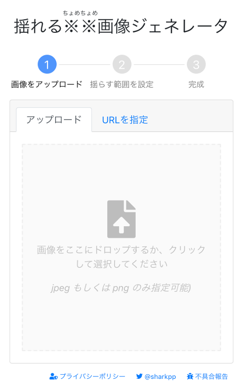
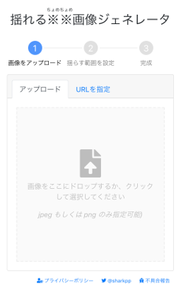
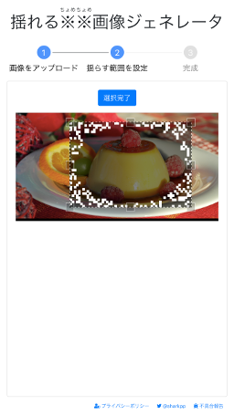
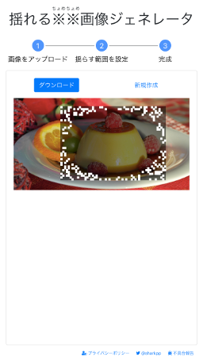

# 揺れる※※画像ジェネレータ

画像を揺らすと一部がなぜか遅れて揺れる画像を作るジェネレータです。

 

[試してみる](https://sharkpp.github.io/delayedmotion/)  

## 使い方

### 「画像アップロード」

* 「アップロード」... ローカルから画像を指定します。
* 「URLを指定」... インターネット上の画像のアドレスを指定し画像を利用します。※オフラインモードでは利用できません。

### 「揺らす範囲を設定」

* 画像上でドラッグすることで範囲を指定します。

### 「完成」

* ダウンロードボタンを選択し画像を保存してください。

## 開発に関するあれこれ

[開発に関するあれこれ](DEVELOP.md)

## ライセンス

このコードは、[The MIT License](http://opensource.org/licenses/MIT)の下でライセンスされています。

サンプル画像は[Pixabay License](https://pixabay.com/service/license/)の下で[#1958386 - pixabay](https://pixabay.com/photos/caramel-cream-flan-milk-egg-sugar-1958386/)を利用しています。
